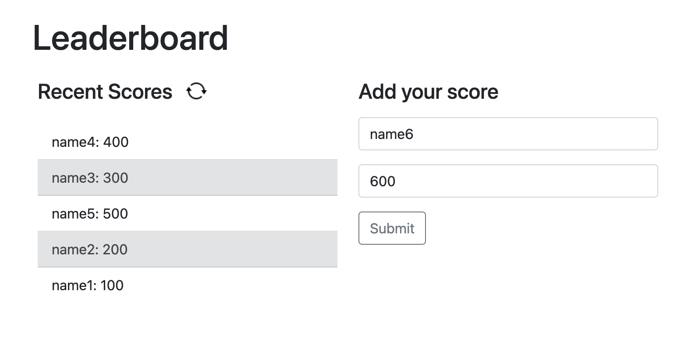

# Leaderboard
Microverse Program Project



## Built With

HTML CSS Javascript

Webpack

## Live Demo


## Getting Started

Get a local copy on you computer, 

```
git clone https://github.com/chuanqizhu0820/Leaderboard.git
```

<!-- ### Prerequisites -->

<!-- ### Setup -->

### Install
install all the packages listed in the package.json file
```
npm install
```

### Usage
build your files in you ./dist folder from those in the ./src
```
npm run build
```
start your webpack dev server
```
npm start
```

<!-- ### Run tests

### Deployment -->

## Authors

👤 **Author1**

- GitHub: [@chuanqizhu0820](https://github.com/chuanqizhu0820)
- LinkedIn: [LinkedIn](https://www.linkedin.com/in/chuanqi-zhu-117b11210/)

## 🤝 Contributing

Contributions, issues, and feature requests are welcome!

Feel free to check the [issues page](../../issues/).

## Show your support

Give a ⭐️ if you like this project!

## Acknowledgments

## 📝 License
